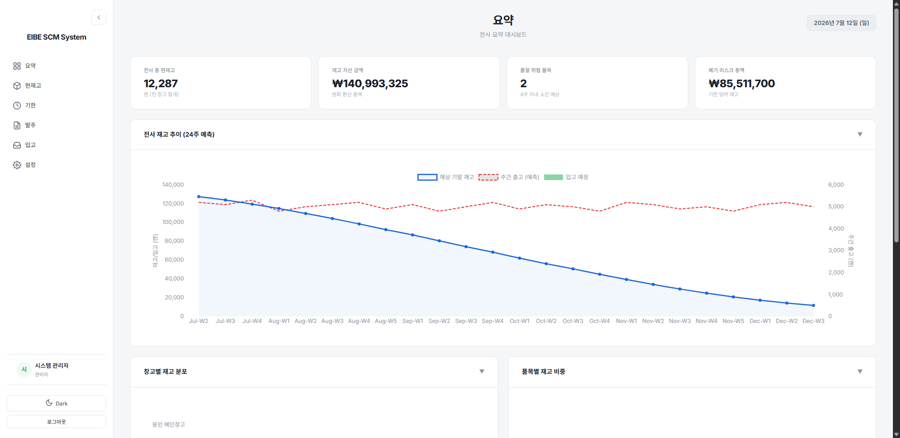
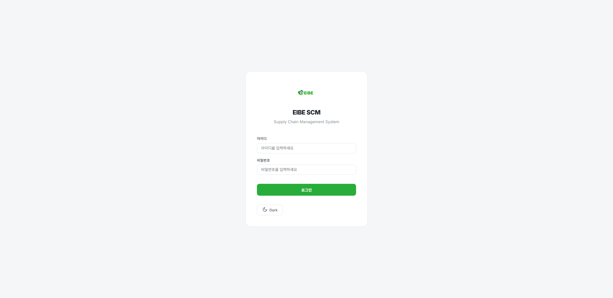
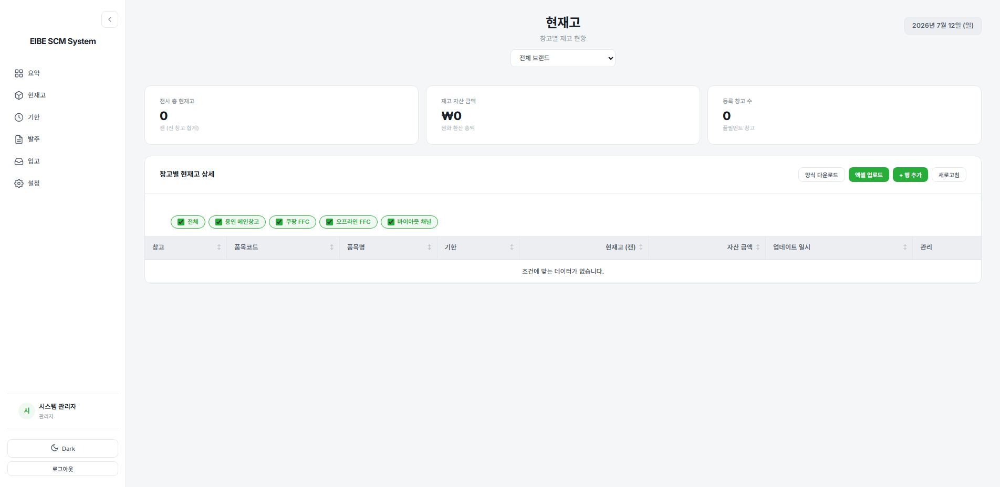
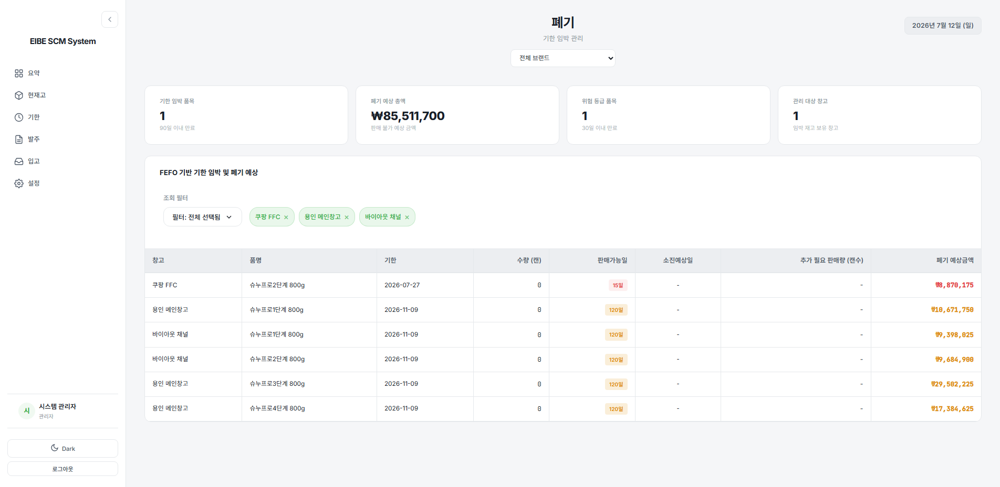
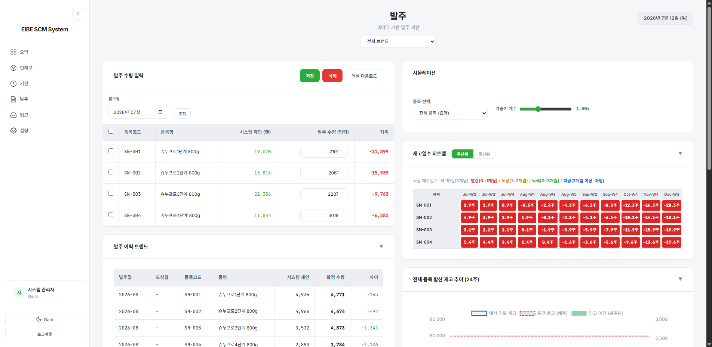
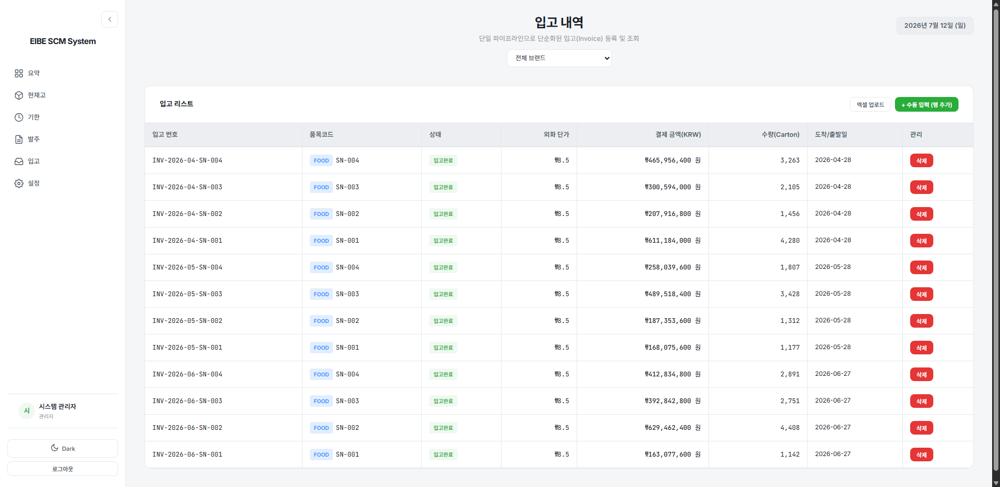
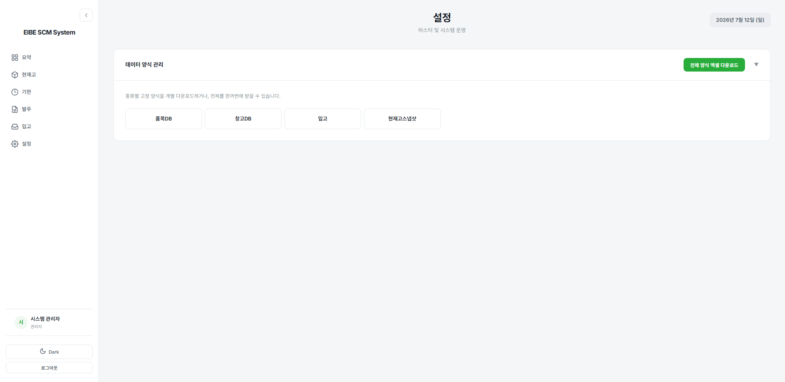
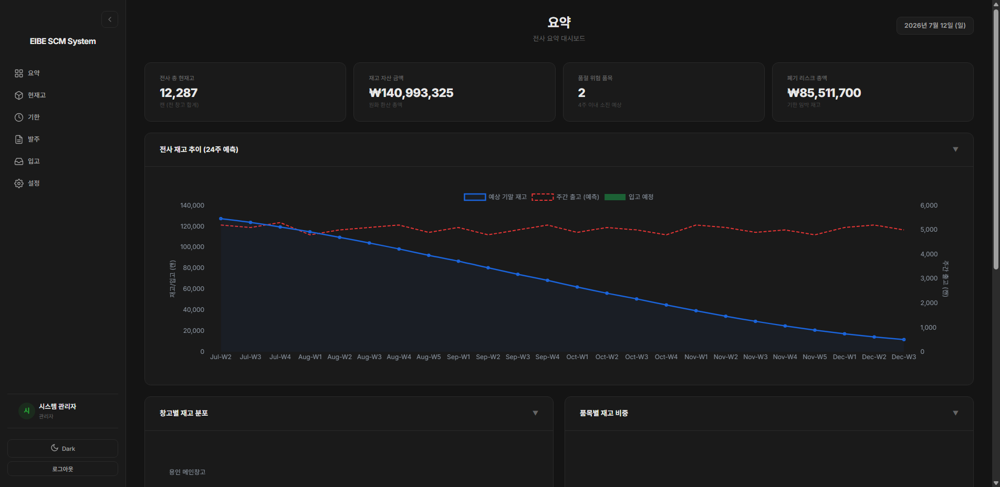

# EIBE SCM Dashboard

> **Standalone Local ERP** for Supply Chain Management — Data-driven Forecasting & Inventory Optimization

<p align="center">
  
</p>

---

## Overview

EIBE SCM Dashboard는 산재된 물류 파이프라인(발주 → 생산 → 입고) 데이터를 **하나의 뷰로 통합**하고, 과거 판매/출고 데이터를 기반으로 한 **데이터 주도적 발주 예측(Data-driven Forecasting)**을 제공하는 독립형 로컬 ERP 시스템입니다.

기존에 수많은 엑셀 파일을 이메일로 주고받으며 수기 매칭과 직관에 의존해왔던 SCM 프로세스를 개선하여, 실무자가 **전략적 의사 결정**에 집중할 수 있도록 돕습니다.

### Key Highlights

- **Zero Cloud Cost**: 사내 PC에서 완전히 독립 실행 — 외부 네트워크 불필요
- **Data-driven Forecasting**: 사칙연산 기반의 투명한 통계 모델로 발주 제안
- **Real-time Simulation**: 수량/가중치 변경 시 재고일수 히트맵 즉시 반응
- **Multi-brand Management**: 식품(FOOD)과 전자제품(ELECTRONICS) 동시 관리, 브랜드별 동적 필터링
- **Dark Mode**: 완벽한 다크모드 지원

---

## Screenshots

<table>
  <tr>
    <td align="center"><strong>Login</strong></td>
    <td align="center"><strong>Dashboard</strong></td>
  </tr>
  <tr>
    <td></td>
    <td></td>
  </tr>
  <tr>
    <td align="center"><strong>Inventory</strong></td>
    <td align="center"><strong>Expiry Management</strong></td>
  </tr>
  <tr>
    <td></td>
    <td></td>
  </tr>
  <tr>
    <td align="center"><strong>Order Planning</strong></td>
    <td align="center"><strong>Inbound Management</strong></td>
  </tr>
  <tr>
    <td></td>
    <td></td>
  </tr>
  <tr>
    <td align="center"><strong>Settings</strong></td>
    <td align="center"><strong>Dark Mode</strong></td>
  </tr>
  <tr>
    <td></td>
    <td></td>
  </tr>
</table>

> 더 많은 스크린샷은 [`portfolio/`](portfolio/) 폴더에서 확인할 수 있습니다.

---

## Tech Stack

| Layer | Technology | Purpose |
|-------|-----------|---------|
| **Frontend** | HTML5, CSS3, Vanilla JS | 프레임워크 없이 경량 UI 구현 |
| **Charts** | Chart.js 4.x (CDN) | KPI 시각화, 재고 추세, 히트맵 |
| **Backend** | Python 3.11, FastAPI, Uvicorn | RESTful API 서버, 비동기 처리 |
| **Database** | SQLite 3 (3NF) | 관계형 스키마, 백업 용이 |
| **Auth** | JWT (python-jose), bcrypt | 토큰 기반 인증, 비밀번호 해싱 |
| **Scheduling** | APScheduler | 자동 DB 스냅샷 백업 |
| **Excel I/O** | pandas, openpyxl | 엑셀 업로드/다운로드 파이프라인 |

---

## Architecture

```
┌─────────────────────────────────────────────────────────┐
│                    Browser (Client)                      │
│  ┌──────────┐ ┌──────────┐ ┌──────────┐ ┌──────────┐   │
│  │index.html│ │inventory │ │order_plan│ │ expiry   │   │
│  │Dashboard │ │  .html   │ │  .html   │ │  .html   │   │
│  └────┬─────┘ └────┬─────┘ └────┬─────┘ └────┬─────┘   │
│       │             │            │             │         │
│       └─────────────┼────────────┼─────────────┘         │
│                     │ REST API (JSON)                     │
├─────────────────────┼───────────────────────────────────┤
│              FastAPI Server (Uvicorn)                     │
│  ┌──────────────────┼───────────────────────────┐       │
│  │            API Router Layer                    │       │
│  │  ┌────────┐ ┌────────┐ ┌────────┐ ┌────────┐ │       │
│  │  │  auth  │ │pipeline│ │  inv   │ │ master │ │       │
│  │  └────────┘ └────────┘ └────────┘ └────────┘ │       │
│  ├────────────────────────────────────────────────┤       │
│  │            Core Business Logic                 │       │
│  │  ┌────────────┐ ┌──────────┐ ┌─────────────┐ │       │
│  │  │forecasting │ │excel_    │ │  snapshot    │ │       │
│  │  │  .py       │ │parser.py │ │    .py       │ │       │
│  │  └────────────┘ └──────────┘ └─────────────┘ │       │
│  ├────────────────────────────────────────────────┤       │
│  │            Data Layer (SQLAlchemy ORM)         │       │
│  │         SQLite 3 — data/local_erp.db           │       │
│  └────────────────────────────────────────────────┘       │
└─────────────────────────────────────────────────────────┘
```

---

## Features

### 1. Executive Dashboard (`index.html`)
전사 합산 KPI 카드 — 총 현재고, 자산 금액, 품절 위험 품목, 기한 임박 SKU를 한눈에 파악. 재고 추세 차트와 할일 알림 위젯 제공.

### 2. Inventory Management (`inventory.html`)
거점별 실재고 및 자산 금액 조회. 창고 필터(체크박스)는 `/api/warehouses` API와 연동하여 자동 생성. 이관 시뮬레이터와 엑셀 업로드 지원.

### 3. Expiry / Warranty Management (`expiry.html`)
FEFO(선입선출) 기반 유통기한 관리. 전자제품의 경우 UI에서 '보증기한'으로 동적 치환. 채널별 소진예상일 산출 및 폐기 예상 금액 시각화.

### 4. Order Planning & Simulation (`order_plan.html`)
출고량 통계 기반 시스템 제안 수량 도출. 리드타임을 고려한 6개월 뒤 도착분 주문 시뮬레이션. 수량 변경 시 히트맵/차트 실시간 반응.

### 5. Inbound Pipeline (`matching.html`)
입고(Invoice) 등록 및 조회. 브랜드 드롭다운 필터링, 상태 관리(생산국출발 → 입고완료), 엑셀 일괄 업로드.

### 6. System Settings (`users.html`)
SPA 패턴의 해시 네비게이션으로 구성된 설정 페이지 — 데이터 양식 관리, 창고/품목 마스터, 사용자 관리, DB 백업/스냅샷, 이관 MOQ 설정.

---

## Inventory Days Heatmap

재고일수 기준의 색상 히트맵으로 즉각적인 시각적 피드백을 제공합니다:

| Range | Color | Status | Description |
|-------|-------|--------|-------------|
| < 6주 | 🔴 Red | `risk-high` | 위험 — 품절 임박 |
| 6~9주 | 🟡 Yellow | `risk-mid` | 주의 — 발주 검토 필요 |
| 9~13주 | 🟢 Green | `risk-low` | 양호 — 적정 재고 |
| > 13주 | 🔵 Blue | `risk-safe` | 과잉 — 이관 또는 할인 검토 |

---

## Quick Start

### Prerequisites
- **Python 3.11+**
- **Chrome** (스크린샷 캡처 시)

### 1. Clone & Setup

```bash
git clone https://github.com/jonghyeok-dev/Eibe-SCM_Dashboard.git
cd Eibe-SCM_Dashboard
```

### 2. Run Server

**Windows** — 더블클릭으로 실행:
```bash
start_server.bat
```

**Manual**:
```bash
python -m venv venv
.\venv\Scripts\activate      # Windows
pip install -r requirements.txt
uvicorn app.main:app --host 0.0.0.0 --port 8000
```

### 3. Access Dashboard
```
http://localhost:8000
```

**Default Login:**
| Field | Value |
|-------|-------|
| ID | `admin` |
| PW | `admin` |

### 4. Load Sample Data (Optional)
```bash
python seed_data.py
```
풍부한 샘플 데이터(품목, 창고, 입고 파이프라인, 재고 스냅샷, 출고 이력, 발주 계획)가 자동 생성됩니다.

---

## Project Structure

```
SCM-Dashboard/
├── app/                          # Backend (FastAPI)
│   ├── main.py                   # App entry point & lifespan
│   ├── models.py                 # SQLAlchemy ORM models (3NF)
│   ├── schemas.py                # Pydantic request/response schemas
│   ├── database.py               # DB engine & session config
│   ├── core/
│   │   ├── auth.py               # JWT auth & password hashing
│   │   ├── excel_parser.py       # Excel upload/download logic
│   │   ├── forecasting.py        # Demand forecasting (stats-based)
│   │   └── snapshot.py           # Auto backup & scheduler
│   └── routers/
│       ├── auth.py               # /api/auth/* endpoints
│       ├── inventory.py          # /api/inventory/* endpoints
│       ├── master.py             # /api/products, /api/warehouses
│       ├── pipeline.py           # /api/orders, /api/inbound
│       ├── system.py             # /api/system/* (backup/restore)
│       ├── users.py              # /api/users/* (account mgmt)
│       └── views.py              # HTML page serving routes
│
├── web/                          # Frontend (Pure HTML/CSS/JS)
│   ├── index.html                # Executive Dashboard
│   ├── inventory.html            # Inventory Management
│   ├── order_plan.html           # Order Planning & Simulation
│   ├── expiry.html               # Expiry / Warranty Management
│   ├── matching.html             # Inbound Pipeline
│   ├── users.html                # System Settings (SPA)
│   ├── login.html                # Login Page
│   └── static/
│       ├── css/style.css         # Global design system (single file)
│       ├── js/app.js             # Shared utilities & components
│       └── img/                  # Brand assets
│
├── data/
│   └── local_erp.db              # SQLite database (auto-created)
│
├── portfolio/                    # Screenshots & demo assets
├── seed_data.py                  # Sample data seeder
├── start_server.bat              # One-click server launcher
└── requirements.txt              # Python dependencies
```

---

## API Documentation

서버 실행 후 자동 생성되는 Swagger UI에서 전체 API를 확인할 수 있습니다:

```
http://localhost:8000/docs
```

### Core Endpoints

| Method | Endpoint | Description |
|--------|----------|-------------|
| `POST` | `/api/auth/login` | 로그인 (JWT 토큰 발급) |
| `GET` | `/api/products` | 품목 마스터 조회 |
| `GET` | `/api/warehouses` | 창고 마스터 조회 |
| `GET` | `/api/inventory/summary` | 전사 재고 요약 |
| `GET` | `/api/inbound` | 입고 리스트 조회 |
| `GET` | `/api/orders` | 발주 목록 조회 |
| `POST` | `/api/inbound/upload` | 입고 엑셀 업로드 |
| `GET` | `/api/forecasting/simulation` | 발주 시뮬레이션 |
| `POST` | `/api/system/snapshot` | DB 스냅샷 생성 |

---

## Design Philosophy

### 1. Transparent Forecasting
복잡한 딥러닝이 아닌, 실무자가 이해 가능한 **사칙연산 기반 통계 모델**을 지향합니다. 최근 출고량의 가중평균을 통해 일/주간 예상 소진율을 도출하며, 예측 근거가 항상 투명하게 노출됩니다.

### 2. Cost-based Asset Valuation
마스터 정보의 예상 단가가 아닌, 실제 입고 시 지불한 **인보이스 결제 원화 금액**을 역추적하여 정확한 재고 자산 금액과 폐기 리스크 비용을 산출합니다.

### 3. Instant Feedback Loop
수량을 입력하는 즉시 재고일수가 색상 히트맵으로 반영됩니다. 별도 "시뮬레이션 실행" 버튼 없이, 모든 클라이언트 사이드 계산은 **실시간(Reactive)**으로 동작합니다.

### 4. Zero Framework Frontend
React, Vue 등 프레임워크 없이 순수 HTML/CSS/JS만으로 구현하여 빌드 프로세스 없이 즉시 구동됩니다. 유지보수 시 별도 도구 체인이 필요하지 않습니다.

---

## Development Notes

- **Null Safety**: 모든 API 응답에 `null`/`undefined` 가드 적용
- **FEFO**: 선입선출(First Expiry, First Out) 기반 유통기한 관리
- **Week Label Format**: `Jun-W3` 형식의 영문 월약어 3글자 패턴
- **Date Format**: `2026년 7월 12일 (토)` 형식
- **Brand Dynamic Filter**: 설정에서 브랜드 추가 시 필터 자동 업데이트
- **Auto Backup**: APScheduler로 일정 주기 DB 스냅샷 자동 생성

---

## License

This project is proprietary software developed for EIBE Corp. internal use.

---

<p align="center">
  <sub>Built with Python, FastAPI, and vanilla JavaScript</sub>
</p>
